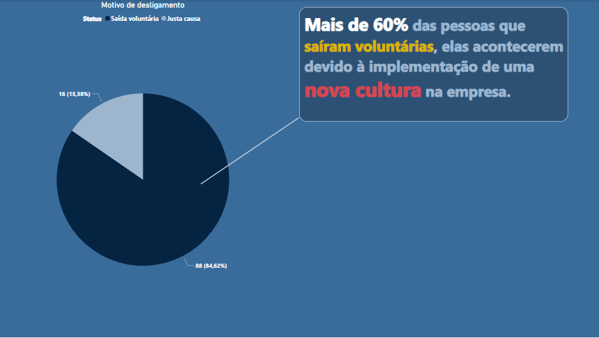
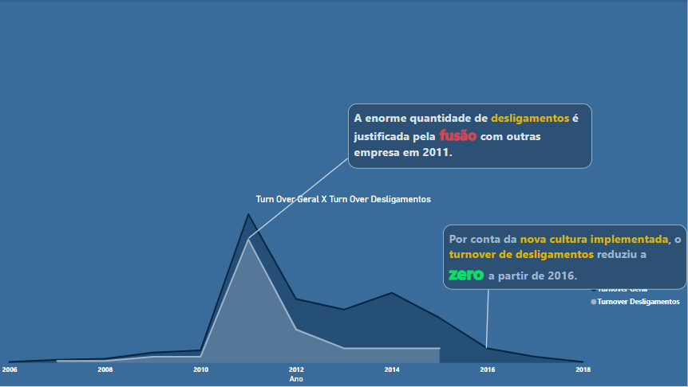
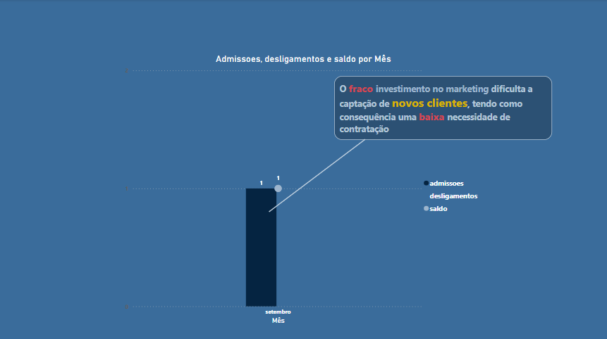
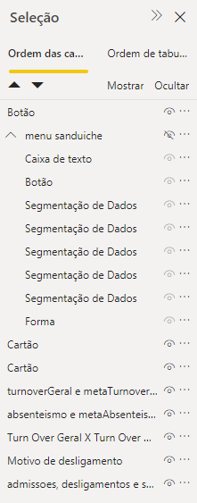
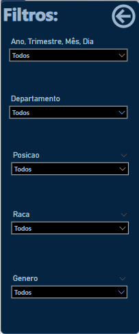
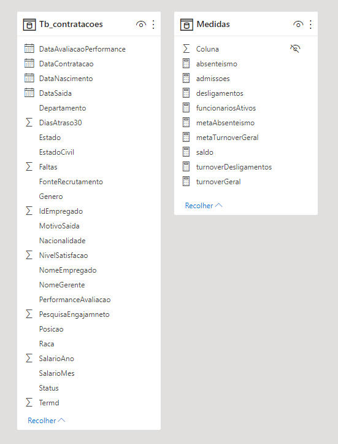

# BI_RH
Nesse projeto estou estudando métricas de RH e novas funções do Power BI como o uso de ferramentas de acessibilidade e menu interativo e análise com storytelling em estudo de cursos.

Neste Projeto eu tive a oportunidade de aprender: 

# Storytelling:
Como comunicar os dados atráves de storytelling com destaque com cores para facilitar o entendimento e uma narrativa concisa. 


	
	
	


# Acessibilidade:

Uso da seleção para ajudar usuários que usam apenas o botão "TAB" 

	

# Menu interativo:
Utilizando um menu de filtros com foco em segmentação de dados.

	

# Métricas de RH:

* Absenteismo:
    ```
    absenteismo = CALCULATE(
    COUNT(Tb_contratacoes[NomeEmpregado]) * AVERAGE(Tb_contratacoes[Faltas])
    /
    (COUNT(Tb_contratacoes[NomeEmpregado])*20),
    Tb_contratacoes[MotivoSaida] = "Continua empregado"
    )
    ```
    
* metaAbsteteismo:
    ```
    metaAbsenteismo = 0.05 
    ```


* Admissoes:
    ```
    admissoes = COUNTROWS(Tb_contratacoes) 
    ```
    
* Admissoes:
    ```
    desligamentos = CALCULATE(COUNTROWS(Tb_contratacoes),Tb_contratacoes[Status] <> "Ativo")
    ```
    
* funcionariosAtivos:
    ```
    funcionariosAtivos = 
    var AdmissoesAcumulado  = CALCULATE([admissoes],FILTER(all(Tb_contratacoes),[DataContratacao] <= max([DataContratacao])))
    var DesligamentosAcumulado = CALCULATE([desligamentos],FILTER(all(Tb_contratacoes),[DataContratacao] <= max([DataContratacao])))
    return AdmissoesAcumulado - DesligamentosAcumulado 
    ```
* turnoverGeral
    ```
    turnoverGeral = DIVIDE(([admissoes]+[desligamentos])/2 , [funcionariosAtivos])
    ```
    
* metaTurnoverGeral
  ```
  metaTurnoverGeral = 0.1 
  ```

* turnoverDesligamentos
  ```
  turnoverDesligamentos = DIVIDE([desligamentos] , [funcionariosAtivos]) 
  ```

* saldo
  ```
  saldo = [admissoes]-[desligamentos]
  ```

# Modelo relacional

	


# Link dashboard

https://app.powerbi.com/reportEmbed?reportId=eb14195e-1c06-406e-b513-704d4745e8fe&autoAuth=true&ctid=da49a844-e2e3-40af-86a6-c3819d704f49&config=eyJjbHVzdGVyVXJsIjoiaHR0cHM6Ly93YWJpLWJyYXppbC1zb3V0aC1yZWRpcmVjdC5hbmFseXNpcy53aW5kb3dzLm5ldC8ifQ%3D%3D


